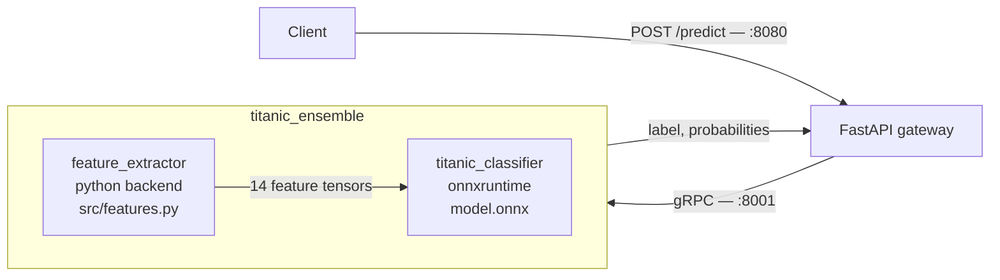

# triton-vs-fastapi-serving

One ONNX classifier, one identical HTTP contract, two serving backends — to compare what
each deployment path actually costs and gives you:

- **FastAPI** — ONNX Runtime in-process, preprocessing in Python.
- **Triton** — NVIDIA Triton Inference Server, preprocessing and the model wired
  together as an ensemble, called over gRPC.

Both paths are held to byte-identical outputs, including how missing values are handled
end to end — the interesting part, since the two runtimes disagree on null semantics by
default.

## Run

Two mutually exclusive profiles. Both expose the same ports, so run one at a time.

Triton stack (Triton Inference Server + FastAPI wrapper + web UI):

```bash
docker compose --profile triton up -d --build
```

FastAPI-only stack (ONNX Runtime in-process + web UI):

```bash
docker compose --profile fastapi up -d --build
```

Stop:

```bash
docker compose --profile triton --profile fastapi down
```

## Services

| Service | URL | Profile |
|---|---|---|
| Web UI | http://localhost:8501 | both |
| API (Swagger UI) | http://localhost:8080/docs | both |
| Triton HTTP | http://localhost:8000 | triton |
| Triton gRPC | localhost:8001 | triton |
| Triton metrics | http://localhost:8002/metrics | triton |

Triton readiness check: `curl http://localhost:8000/v2/health/ready`

## Architecture

The FastAPI profile is one process: Pydantic validates, `FeatureExtractor` runs in-line,
ONNX Runtime scores. The Triton profile splits the same two steps across an ensemble,
with a thin FastAPI gateway keeping the HTTP contract identical:



Both profiles read the same `src/features.py` and the same `artifacts/`, bind-mounted
into place by `docker-compose.yml` — one copy of the code, one copy of the weights.

## Null handling

A tensor has no `NULL`: every element must hold a value from its dtype's domain. Floats
get one for free — IEEE 754 reserves `NaN` — so `Age` and `Fare` cross the wire intact.
Strings have no reserved value, so `Cabin` and `Embarked` arrive at
`FeatureExtractor.transform` in three different shapes:

| Path | Arrives as | Caught by |
|---|---|---|
| FastAPI — Pydantic `Optional[str] = None` | `None` | `.isna()` |
| Triton — all rows null, client omits the tensor, the stub fills it | `np.nan` | `.isna()` |
| Triton — mixed batch, tensor is sent, BYTES serialization stringifies the NaN | `"nan"` | `== 'nan'` |

Hence the two-branch mask in `src/features.py`:

```python
missing_mask = X_out[cols].isna() | (X_out[cols] == 'nan')
```

Nobody chose `"nan"` — it falls out of `str(float('nan'))` inside tritonclient's BYTES
serializer, an implementation detail of the client library leaking into the data
contract. A declared sentinel, or a companion BOOL mask tensor, would be the honest fix;
the two-branch mask is the cheap one.

`optional: true` in `config.pbtxt` only helps when *every* row in the batch is null —
a dense tensor cannot omit a single element. That is why a batch mixing present and
missing values is the case worth testing: it is the only one that reaches the
`== 'nan'` branch.

## Benchmark

Same HTTP contract on `:8080` for both stacks, so one load generator ([`oha`](https://github.com/hatoo/oha))
hits both. Single host, CPU only, 12 cores. Per cell: 5s warm-up discarded, 20s measured.
Throughput in **predictions/sec** — a batch request carries 32 rows, so requests/sec
would not compare across endpoints.

`POST /predict` — one row per request:

| Concurrency | FastAPI p50 | FastAPI p95 | FastAPI pred/s | Triton p50 | Triton p95 | Triton pred/s |
|---|---|---|---|---|---|---|
| 1 | 6.55 ms | 7.96 ms | 148 | 23.17 ms | 34.96 ms | 40 |
| 8 | 59.05 ms | 83.02 ms | 133 | 80.71 ms | 127.47 ms | 92 |
| 32 | 251.40 ms | 325.36 ms | 127 | 305.05 ms | 444.13 ms | 99 |

`POST /predict_batch` — 32 rows per request:

| Concurrency | FastAPI p50 | FastAPI p95 | FastAPI pred/s | Triton p50 | Triton p95 | Triton pred/s |
|---|---|---|---|---|---|---|
| 1 | 7.41 ms | 8.99 ms | 4219 | 11.06 ms | 12.98 ms | 2827 |
| 8 | 65.29 ms | 88.32 ms | 3802 | 65.02 ms | 78.89 ms | 3812 |
| 32 | 269.01 ms | 339.40 ms | 3764 | 260.43 ms | 314.80 ms | 3811 |

### Reading this

Triton's overhead — tensor marshalling, gRPC, IPC with the Python backend — is paid
per *request*, not per row. One row in flight: that overhead is most of the response
time. Spread over 32 rows: gone. So the question isn't which server is faster, it's
how many rows the client can put in one call.

Batching beats concurrency 33× on either stack — 4219 pred/s from one client sending
batches, 127 from 32 clients sending single rows.

Both stacks hit the same wall: the pandas preprocessing in `src/features.py`. The ONNX
inference itself is 0.26 ms, under 1% of the response time. FastAPI is GIL-bound on
one core out of twelve; Triton is bound by a single Python-backend instance.

The tail says the same thing as the median. On single rows Triton's p95/p50 runs ~1.5
against FastAPI's 1.2–1.3 — the batcher's timeout widens the spread, not just the
centre. On full batches the ordering flips and both tighten (1.17–1.21 vs 1.21–1.26).

Triton's per-request budget at concurrency 1, from `nv_inference_*_duration_us`:

| Phase | One row | 32 rows |
|---|---|---|
| Queue — `feature_extractor` | 10.16 ms | 0.09 ms |
| Compute — `feature_extractor` | 11.57 ms | 8.46 ms |
| Queue + compute — `titanic_classifier` | 0.18 ms | 0.30 ms |
| gRPC + gateway (residual) | ~1.3 ms | ~2.2 ms |

### Two configuration findings

**A dynamic batcher on the second ensemble stage is pure cost.** Triton schedules each
ensemble step independently, so the classifier's batcher waits out its own
`max_queue_delay_microseconds: 10000` on input the upstream step already batched.
Removing it: single-row p50 **34.04 → 23.17 ms**, classifier queue time 10.17 → 0.06 ms.
Harmless once requests arrive full — a batch at `max_batch_size` dispatches immediately —
so it's a call about expected traffic shape, not a rule.

**An unfilled batch burns CPU, not just latency.** Every single-row run sat at ~1000%
CPU while serving 40–99 req/s; every 32-row run at ~85%. The difference is whether the
batcher fills before its timeout — waiting appears to be a busy-wait. Clean correlation
over eight runs, not traced to source.

### What this does not measure

One small tabular model, CPU only, client and server sharing 12 cores. Triton's actual
arguments — GPU sharing, multi-model hosting, versioning, concurrent model execution —
are all outside this setup. The numbers establish the floor: what Triton costs before
any of that earns it back.
